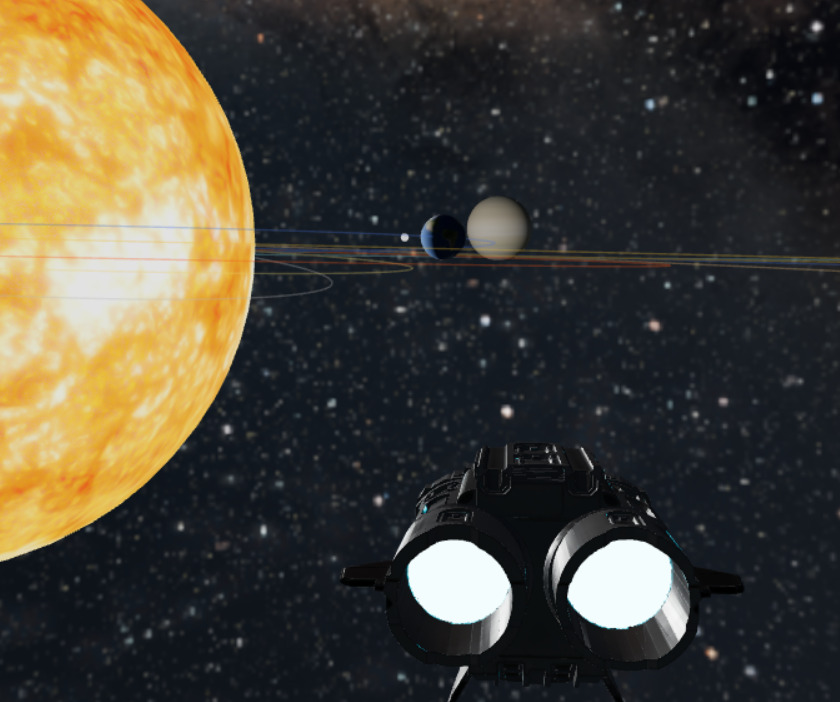

# SPACE — Simulação 3D do Sistema Solar com Nave Pilotável

[]()
[]()
[]()
[]()

---
---

# **Vídeo de Demonstração**
YouTube: https://youtu.be/bZj1B2F4xoU

---

# **Descrição Geral**
Este projeto é uma simulação 3D interativa desenvolvida com **Three.js** e **WebGL**, permitindo que o usuário pilote uma nave através de um sistema solar em escala reduzida (mas proporcional). O cockpit possui visão em primeira pessoa, e também existem modos alternativos de câmera para explorar o sistema solar inteiro.

---

# **Pré-requisitos**
- **Node.js** 
- **npm** (vem junto com Node.js)

Verifique as versões:
```bash
node -v
npm -v
```

---

# **Instalação do Projeto**
Clone o repositório:
```bash
git clone https://github.com/<usuario>/<repositorio>.git
cd <repositorio>
```

Instale as dependências:
```bash
npm install
npm install three
```

Execute o ambiente de desenvolvimento:
```bash
npm run dev

npx vite
```

---

# **Como Jogar**
### **Controles da Nave**
| Tecla | Ação |
|-------|-------|
| **W / S** | inclina a nave para cima/baixo |
| **A / D** | gira a nave lateralmente |
| **Mouse** | movimenta a câmera |
| **Espaço (Space)** | acelera |
| **C** | alterna modo de câmera |

### **Modos de Câmera**
- **Follow (padrão):** terceira pessoa, seguindo a nave
- **FirstPerson (cockpit):** visão interna realista da nave
- **Orbit (OrbitControls):** câmera livre para visualizar o sistema solar

---

# **Escala dos Planetas e Distâncias**
A simulação utiliza **proporções reduzidas** para manter as relações do sistema solar.

## **Tamanhos dos Planetas (Escala do Código)**
| Corpo Celeste | Escala |
|--------------|--------|
| Sol | 40 |
| Mercúrio | 1 |
| Vênus | 2.2 |
| Terra | 2.4 |
| Lua | 0.4 |
| Marte | 1.4 |
| Júpiter | 12 |
| Saturno | 8 |
| Urano | 4 |
| Netuno | 3.8 |

## **Distâncias (1 unidade ≈ 1.000.000 km)**
| Corpo Celeste | Distância Real (km) | Escala no Projeto |
|----------------|---------------------|-------------------|
| Terra → Lua | 384.400 km | 4 u |
| Terra → Sol | 149.600.000 km | 150 u |
| Sol → Mercúrio | 57.900.000 km | 58 u |
| Sol → Vênus | 108.200.000 km | 108 u |
| Sol → Marte | 227.900.000 km | 228 u |
| Sol → Júpiter | 778.500.000 km | 780 u |
| Sol → Saturno | 1.433.000.000 km | 1430 u |
| Sol → Urano | 2.877.000.000 km | 2870 u |
| Sol → Netuno | 4.503.000.000 km | 4500 u |

---

# **Estrutura do Projeto**
```
Space/
├── node_modules/
├── public/
│   └── assets/
│       ├── texturas/     # Texturas dos planetas e skybox
│       ├── models/       # Modelos 3D (.glb)
│       └── sounds/       # Áudios
├── src/
│   ├── core/
│   │   ├── App.js
│   │   ├── Scene.js
│   │   ├── CameraManager.js
│   │   ├── Input.js
│   │   └── AudioManager.js
│   ├── entities/
│   │   └── Spaceship.js
│   └── main.js
├── index.html
├── package.json
└── README.md
```

---

#  **Créditos e Licenças**
## **Modelos 3D**
- *Cockpit*: "Sci-fi Spaceship Cockpit 02" [https://skfb.ly/6VrVK] — CC BY 4.0
- *Nave Externa*: "SpaceShip" [https://skfb.ly/oJrVX] — CC BY 4.0

## **Texturas**
- https://www.solarsystemscope.com/textures/
- https://www.spacespheremaps.com/

## **Áudio**
- Engine Loop — Google Drive
- Ambient Space — Google Drive


#  **Próximos Recursos**
- Sistema de colisão
- HUD do cockpit
- Exibição de dados dos planetas
- Autopiloto + rotas automáticas
- Sistema de órbita automática

---

#  **Tecnologias Utilizadas**
- Three.js
- WebGL
- Vite
- Node.js

